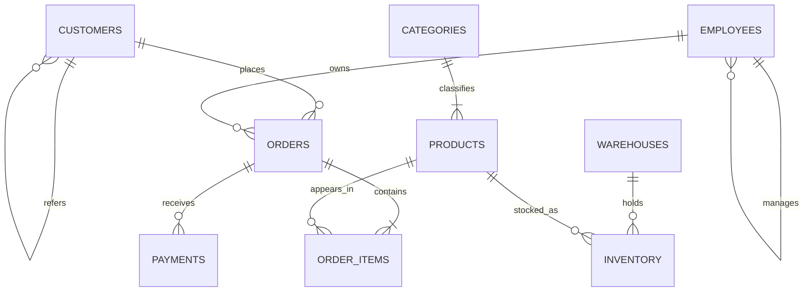

# Playground data model

All practice tables are in the `shop` schema, which is the default search path for `sql_student`.



## Important grains

| Table | One row represents | Key |
|---|---|---|
| `customers` | one customer company | `customer_id` |
| `products` | one catalog product | `product_id` |
| `employees` | one employee | `employee_id` |
| `orders` | one customer order | `order_id` |
| `order_items` | one product line on one order | `(order_id, product_id)` |
| `payments` | one payment attempt or event | `payment_id` |
| `warehouses` | one physical warehouse | `warehouse_id` |
| `inventory` | one product's stock at one warehouse | `(warehouse_id, product_id)` |

`products.unit_price` is today's catalog price. `order_items.unit_price` is the historical price charged on that order and must be used for revenue. `order_items.discount` is a fraction: `0.100` means 10%. A discounted line total is:

```sql
quantity * unit_price * (1 - discount)
```

An order can have multiple payment rows, and a payment's status matters. Joining raw items and raw payments at once creates a many-to-many fan-out; aggregate each side to one row per order first.

## Edge cases included on purpose

- Customers 13 and 14 have no orders; customer 14 also has missing country, email, and phone.
- Products 16 and 17 have never been ordered; product 17 also has no inventory rows. Product 15 is discontinued.
- Category 5 (`Wellness`) has no products, exercising empty-group and outer-join behavior.
- Several products are absent from some warehouses.
- Some inventory is at or below its reorder threshold.
- Orders include pending, processing, cancelled, refunded, and completed states.
- Order 1011 has two successful payments; other orders have failed, pending, or refunded payments.
- Customer and product `metadata`/`attributes` columns are JSONB with nonuniform keys.
- Employees form a three-level self-referencing management tree.

Use `\d table_name` in `psql` for exact column types and constraints. The source of truth is [fixtures/00_schema.sql](../fixtures/00_schema.sql).
